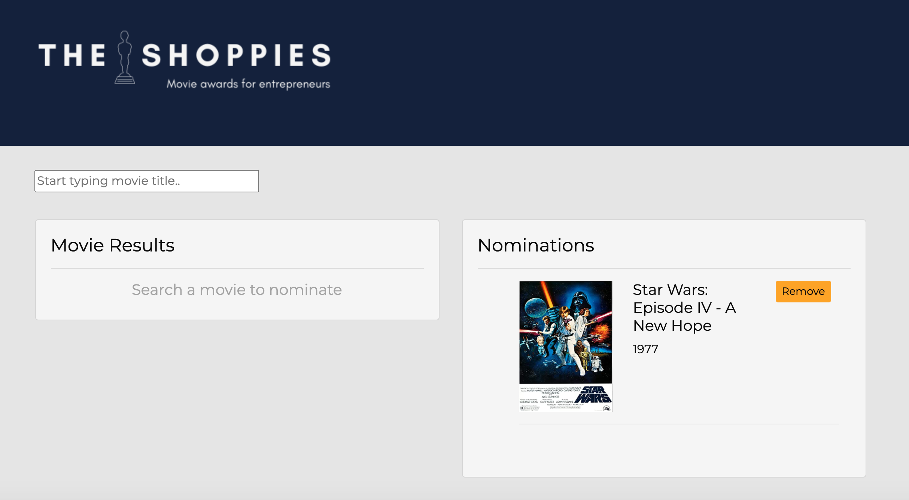

<!-- PROJECT LOGO -->
<br />
<p align="center">
  <a href="https://github.com/jwhityoung/TheShoppies">
    
  </a>

  <h3 align="center">The Shoppies</h3>

  <p align="center">
   Shopify has branched out into movie award shows. The Shoppies app allows users to serach for movies and nominate up to five for the upcoming Shoppies.
    <br />

  </p>
</p>


<!-- TABLE OF CONTENTS -->
## Table of Contents

* [About the Project](#about-the-project)
  * [Built With](#built-with)
* [Getting Started](#getting-started)
  * [Installation](#installation)
* [Contact](#contact)


<!-- ABOUT THE PROJECT -->
## About The Project




### Built With

* [Create React App](https://reactjs.org/docs/create-a-new-react-app.html)
* [React Bootstrap](https://react-bootstrap.github.io/)
* [Axios](https://www.npmjs.com/package/axios)


<!-- GETTING STARTED -->
## Getting Started

To get a local copy up and running follow these simple steps.


### Installation

1. Clone the repo
```sh
git clone https://github.com/jwhityoung/TheShoppies
```
2. Install NPM packages
```sh
npm install
```
3. Create .env file with you OMDB API Key
```sh
REACT_APP_OMDB_API_KEY=Your API Key
```

4. Run Start 
```sh
npm start
```


<!-- CONTACT -->
## Contact

Whitney Young - jwhityoung@gmail.com

Project Link: [The Shoppies](https://shoppies-nominations.herokuapp.com/)


